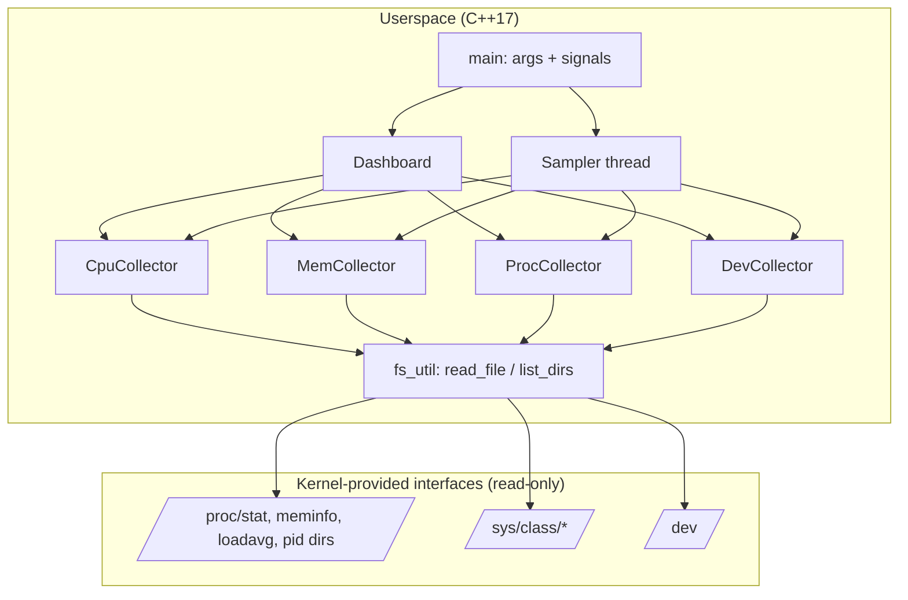
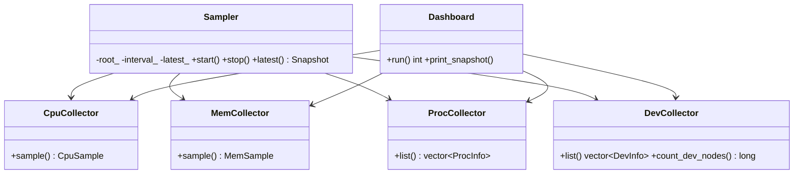
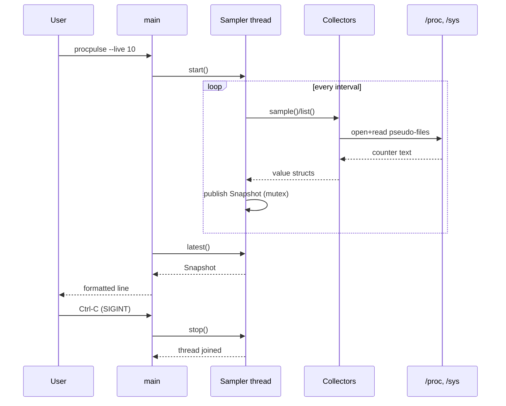
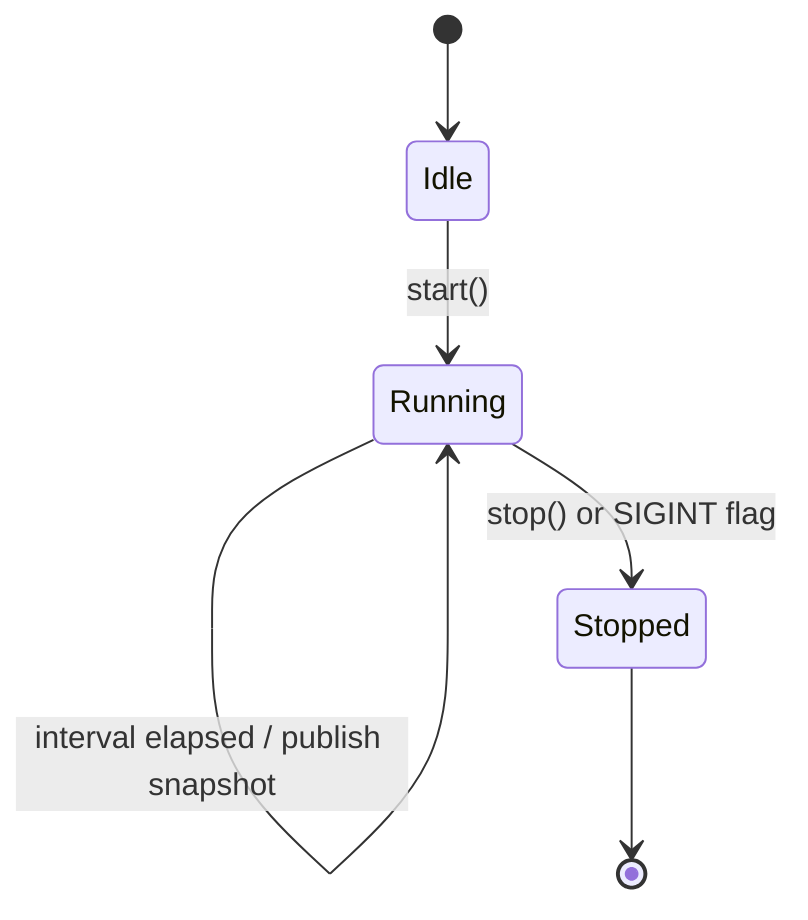

# Stage 3 — System Design & Architecture

## Architecture

Data flows one way: pseudo-files → parsers → value structs → presentation. The kernel side
is where drivers and subsystems publish hardware state; ProcPulse is a pure consumer,
which is what makes the project safe and portable.

## Component responsibilities

| Component | Responsibility |
|---|---|
| `fs_util` | `read_file`, `list_dirs`, `list_entries`, `path_exists`; single place that touches paths |
| `CpuCollector` | Parse `/proc/stat` + `/proc/loadavg`; `usage_between()` delta math |
| `MemCollector` | Parse `/proc/meminfo` into `MemSample` |
| `ProcCollector` | Enumerate numeric `/proc` dirs; parse `comm` + `stat` per PID |
| `DevCollector` | Walk `/sys/class/<subsystem>/<device>`; count `/dev` entries |
| `Sampler` | Poll all collectors on a thread at a fixed interval; publish immutable `Snapshot` |
| `Dashboard` | Menu loop and formatted output; also used by `--once` |
| `main` | CLI flags (`--root`, `--interval`, `--once`, `--live`), SIGINT/SIGTERM wiring |

## Key data structures

- `CpuSample` — counter set + `total()` / `busy()` helpers; load averages
- `MemSample` — kB fields + derived `used_kb()` / `usage_percent()`
- `ProcInfo` — `{pid, name, state}`
- `DevInfo` — `{subsystem, name}`
- `Snapshot` — immutable bundle published by `Sampler` under a mutex

## UML

### Class diagram

### Sequence diagram (live mode)

### State machine (Sampler)

## Implementation plan

1. `fs_util` + `CpuCollector` end-to-end, verified against fixtures
2. Remaining collectors, each with a unit test added immediately
3. `Dashboard` menu + `--once`
4. `Sampler` thread + `--live` + signal handling
5. Integration script, devlog, report

## Development environment & tooling

- Ubuntu 24.04+ (or WSL2), `build-essential` (g++ ≥ 9, make), Git
- Build: `make`; tests: `make test`
- Editor-agnostic; C++17, `-Wall -Wextra`

## Git repository & branching strategy

- `main` — tagged releases only (`stage-1`…`stage-6`, `v1.0`)
- `develop` — integration branch
- `feature/<topic>` — one per collector/subsystem, merged via pull request in team settings
  (individual work: merged locally after self-review)
- Commit style: imperative subject, e.g. `add meminfo parser with fixture test`
